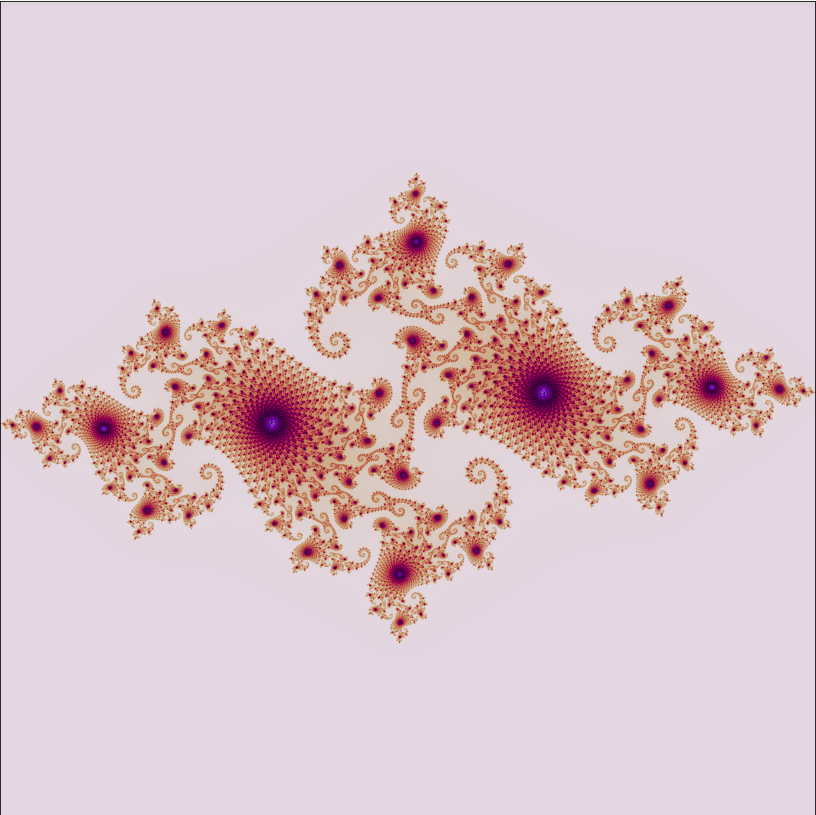

# Julia-Set
Implementation  Julia set with different color maps

## Setup

Clone the repository and change the working directory:

    git clone https://github.com/SvNext/Julia-Set.git
    cd Julia-Set
Create and activate the virtual environment:

    python3 -m venv env
    source env/bin/activate
Install requirements:

    pip install -r requirements.txt

Run the jupyter notebook:

    jupyter notebook julia_set.ipynb
    
    
## Results

Сhoose one of the values of _c_ or prescribe it yourself and consistently run the all cells.

